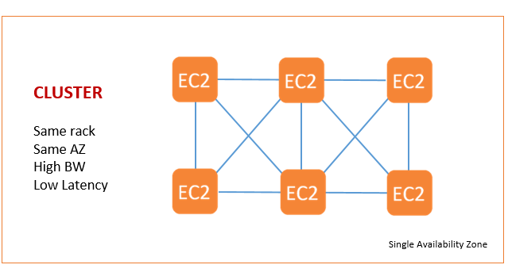
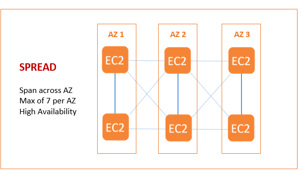
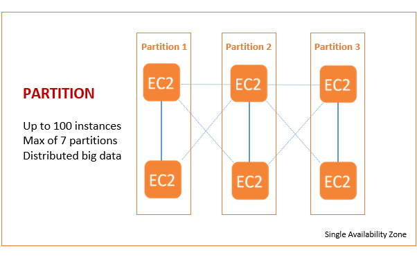
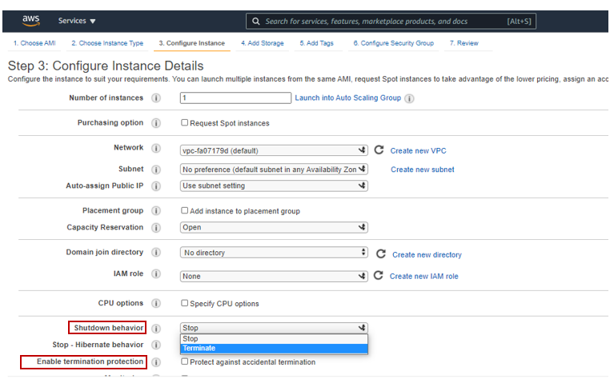
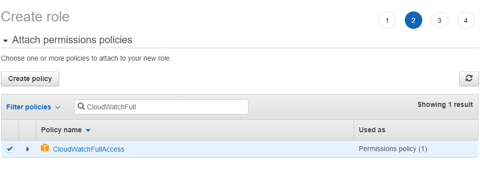

<!-- 2021-01-27 06:03:44 -->

# 01 - EC2 for SysOps #
________________________________________________

<p align=center>
    
</p>

The focus of these note will be on EC2 from the SysOps perspective:

- Operations
- Troubleshooting
- Instance Types
- Launch Modes
- AMI
- CloudWatch

It is also assumed that you have prior knowledge or some basics of Amazon Web Services. The  AWS Console UI changes from time to time so the images that you may see in my notes might not be the same with what you see on your console.

This document is broken down into these sections:

1.  [Changing Instance Type](#changing-instance-type)
2.  [EC2 Placement Groups](#ec2-placement-groups-csp)
3.  [Shutdown Behavior and Termination Protection](#shutdown-behavior-and-termination-protection)
4.  [EC2 Launch Issues](#ec2-launch-issues)
5.  [EC2 SSH Issues](#ec2-ssh-issues)
6.  [EC2 Instance Launch Types](#ec2-launch-types)
7.  [Spot Instances and Spot Fleet](#spot-instances-and-spot-fleet)
8.  [EC2 Instance Types - Deep Dive](#ec2-instance-types-deep-dive)
9.  [EC2 AMIs](#ec2-amis)
10. [Cross-account AMI Copy](#cross-account-ami-copy)
11. [Elastic IPs](#elastic-ips)
12. [CloudWatch Metrics for EC2](#cloudwatch-metrics-for-ec2)
13. [Custom CloudWatch Metrics](#custom-cloudwatch-metrics-for-ec2)
14. [CloudWatch Logs for EC2](#cloudwatch-logs-for-ec2)
15. [Unified CloudWatch Agent](#unified-cloudwatch-agent)

________________________________________________

## CHANGING INSTANCE TYPE ##

This is a commonly done in SysOps. Notes to remember are:

- can only be done on EBS-backed instances
- you need to stop the instance before changing the instance type
- from instance settings, click **Change Instance Type** 
- we can upsize and downsize
- on some instances, we have an option to tick **EBS Optimized**
- once changed, restart instance
- the public ip may change when you reboot an instance

Before restarting instance, I have t2.micro:

    [ec2-user@ip-172-31-27-248 ~]$ free -m
                  total        used        free      shared  buff/cache   available
    Mem:            983          75         506           0         401         770
    Swap:             0           0           0

After changing to the a bigger one - t2.small:

    [ec2-user@ip-172-31-27-248 ~]$ free -m
                  total        used        free      shared  buff/cache   available
    Mem:           1991          76        1730           0         183        1776
    Swap:             0           0           0

________________________________________________

## EC2 PLACEMENT GROUPS - CSP ##

These are used to control EC2 Placement strategy within the AWS infrastructure.

- no direct interaction with hardware
- we just let AWS know how we want our instances to be 'arranged'
- three EC2 placement group options:

1.  **Cluster**
    - same rack, same AZ
    - Instances are grouped together in 1 Availability Zone.
    - low latency - 10 Gbps BW 
    - high performance, but high risk
    - if rack fails, all instances fial at the same time
    - for applications that needs to complete fast

        

2.  **Spread**
    - span across multiple AZ
    - instances are spread across different hardware
    - limit of **7** instances **per AZ per group**
    - for **max availability**
    - for critical applications

        

3.  **Partition**
    - similar with spread
    - spread on different partitions on different racks within an AZ
    - risk of failures can be isolated by partitions
    - up to **100 instances per group**
    - used for big data applications (Hadoop, Cassandra, Kafka)

        


To use Placement Groups, create the **Placement group** under **Network and Security** first and then when you're configuring instance details during instance creation, choose your Placement group.


________________________________________________

## SHUTDOWN BEHAVIOR AND TERMINATION PROTECTION ##

You can enable termination protection and shutdown behavior during instance creation or while its running.

**SHUTDOWN BEHAVIOR**
This is how the instance will react when shutdown from OS, not on AWS Console or API. There are two options here:
- Stopped (default)
- Terminated

Note that the CLI Attribute is **InstanceInitiatedShutdownBehavior**

**TERMINATION PROTECTION**
Protection against accidental termination in AWS Console or CLI.
- **Shutdown Behavior > Termination Protection**
- If SB=Terminate, then it'll terminate instance regardless if TP is enabled.



________________________________________________

## EC2 LAUNCH ISSUES ##


**InstanceLimitExceededError**
This means you have reached max number of running On-demand instances per region. The limits are counted in vCPU.

 - Max vCPU per region: 32
 - Either launch instance i another region or open support ticket to AWS to increase limit on your region.

You can view current limit in your region through the EC2 console.


<br>

**InsufficientInstanceCapacity**
This means AWS doesn't have much On-demand capacity in the particular AZ to which instance is launched.

- wait for a few minutes before requesting again
- break down requests into smaller ones.
- request for a different instance type and then resize later.

<br>

**Instance Terminates Immediately**
You are able to start instance but it went from pending to terminated immediately.

- EBS limit is reached
- EBS volume is corrupt
- root EBS volume is encrypted and you don't have access to KMS key for decryption.
- instance store-backed AMI is missing a part.

To see how the instance was terminated abruptly, you can select Settings icon at the upper right of the EC2 console to show **State Transition**.


(The [AWS Documentation](https://docs.aws.amazon.com/AWSEC2/latest/UserGuide/troubleshooting-launch.html) has a whole section discussing about instance launch issues. You can also view per-region [EC2 service quotas](https://docs.aws.amazon.com/AWSEC2/latest/UserGuide/ec2-resource-limits.html).

________________________________________________

## EC2 SSH ISSUES ##

**Unprotected Private Key File Error**
This means the private key file in your Linux machines doesn't have the necessary permissions. Make sure to set the .pem file to allow read permission - chmod 400

**Hostkey not found Error**
Username used in logging via SSH to the instance is not found.
You'll usually get a **permission denied** message.

**Connection Timeout**
This is usually caused by security groups not configured correctly.
It's also possible that CPU load is high that the instance cannot reply back.
________________________________________________

## EC2 LAUNCH TYPES ##

1.  **On-demand Instances** 
    - used for short workload and uninterrupted workloads
    - pay for what you use (billing per second, after the first minute)
    - highest cost, but no upfrontpayment
    - no long-term commitment

2.  **Reserved Instance** 
    - Minimum of **1 year**
    - up to **75% discount** compared to On-demand
    - upfront payment for long-term commitment
    - reservation can be 1 or 3 years        
    - recommended for steady usage, example is database
    - three types of reserved instances (RI):

        - **Reserved Instances** - specific instance type for long workloads
        - **Convertible RI** - can convert to other instance types 
        - **Scheduled RI** - reserving instances in a specific schedule

3.  **Spot Instance** 
    - short workloads, you can lose instances any time.
    - up to **90% discount** compared to On-demand
    - most cost-efficient but less reliable, you can *'lose'* instances any time
    - if current spot price is higher than your max price, you lose the instance
    - **max price** - how much you're willing to pay for the spot instance
    - **current spot price** - bidding price or market price
    - not recommended for critical applications or database
    - for workloads resilient to interruptions or failures
        - batch jobs
        - data analysis
        - image processing
        - any job that can be re-tried
    - **Suggested:** RI + On-demand + Spot
    - Use RI for baseline capacity with predictable usage
    - Use Spot or On-demand for jobs with unpredictable workload

4.  **Dedicated Instances**
    - no other customer will share your hardware.
    - may share with other instance under the same account
    - no control on instanc eplacement
    - no control on underlying hardware

5.  **Dedicated Host** 
    - Entire physical EC2 server is dedicated to you
    - Full control of EC2 instance placement
    - Full control on sockets/physical cores
    - **3 year** period reservation, more expensive
    - For companies with strong regulatory and compliance needs
    - For software with BYOL licensing model
    - **BYOL** - Bring Your Own License

    <br>

    Below is comparison between dedicated hosts vs. dedicated instances

<p align=center>
    
</p>

You can set instance launch types during creation of instance


#### INTERRUPTION BEHAVIOR ####
You can set what will happen to your spot instance when it is terminated and reclaimed by AWS.
- terminate / delete
- stop instance (you can then re-assign workload or change instance type)

#### PERSISTENT REQUEST ####
When you have a persistent spot request, you'll automatically have another spot instance created when the current instance is terminated by AWS. 

Note that if you terminate your own instance, it will just go through the same cycle - AWS checks if spot request is still valid and if it is, it will launch a new instance. To fully stop an instance from going through the persistent request cycle:

1.  Spot request must be in either of these states:
    - **open**
    - **active**
    - **disabled state**
2.  Cancelling a spot request does not terminate the instance
3.  You must first cancel the spot request
4.  then delete the instances

<p align=center>
    
</p>

To configure persistent request and interruption behavior


________________________________________________

## SPOT INSTANCES AND SPOT FLEET ##

**SPOT INSTANCES**
You can define a max spot price and get the instance while **current spot price < max price you're willing to pay**.

- spot prices are quite stable for periods of time
- but it will be projected as changing from the exam's perspective
- you define the max spot price you're willing to pay in a **spot request** 
- the hourly spot price varies based on **offer** and **capacity**
- AWS gives **2 minutes period** before fully reclaiming spot instance
- if you don't want the instances to be reclaimed, you can use Spot Block

**SPOT BLOCK**
You can *block* spot instances for a specified period of time without interruptions.
- 1 to 6 hours
- this is pretty rare since AWS can still reclaim the instance

**SPOT REQUEST**
This contains the following details
- Max price you're willing to pay
- Desired number of instances
- Launch specifications
- Validity - from and to
- Request-type:
    - **One-time**
        As soon as your request is fulfilled and spot instances are launched, the spot request is deleted.

    - **Persistent**
        Spot request will keep fulfilling the desired number of instance during it's period. This meant automatically creating another instance when current number of instance goes beyond the desired number. Cancelling persistent requests are discussed [here](#persistent-request)

**SPOT FLEET**
It is a set of mixed type of instances - Spot + On-demand
- Builds target capacity based on price constraints
- Can have multiple launch pools to choose from
- Automatically does the 'mix-and-match' based on your budget
- You can define your strategies:
    
    - **lowestprice**
        - Launching instances from pool with the lowest price
        - cost optimization
        - short workloads

    - **diversified**
        - Launched instances are distributed across pools
        - great for availability
        - longer workloads

    - **capacityOptimized**
        - Instances are chosen from pool with optimal capacity
________________________________________________

<!-- 2021-01-28 03:06:15 -->

## EC2 INSTANCE TYPES - DEEP DIVE ##

There are a lot of available EC2 instance types but these are the ones we can focus on for the exam:

| Types | Use Cases |
| :-: | :- |
| **R** | needs a lot of RAM, e.g. in-memory cache |
| **C** | needs good CPU, e.g. compute, databases |
| **M** | somewhere in the middle, e.g. balanced apps, web app, general |
| **I** | needs good local I/O, e.g. instance storage, databases |
| **G** | applications that need GPU, video-rendering, ML |
| **T2/T3** | burstable (up to a capacity) |
| **T2/T3 Unli** | Unlimited burst |

You can check out more information in this [comparison page.](ec2instances.info)
________________________________________________________________

#### BURSTABLE INsTANCES (T2/T3) ####

Overall performance of EC2 instance is good, but for situations where the machine processes something unexpected - like a load spike, CPU can **burst out**, basically boosting power.
- During burst, CPU is good
- Burst credits are also used
- If credits are all used up, CPU becomes *BAD*.
- You accumulate burst credits when CPU is not bursting
- The larger the instance type, the larger the burst, the faster you accumulate
- If your load constantly burst, you may need to move to a different isntance type

You can check out some comparison on the CPU credits here:


________________________________________________________________

#### T2/T3 UNLIMITED ####

Unlimited burst credit balance
- you dont lose performance, but you may need to watch your expenses
- costs could go high if you don't monitor your usage

You can read more about burstable instances on the linkes below:
- [Unlimited mode for burstable performance instances](https://docs.aws.amazon.com/AWSEC2/latest/UserGuide/burstable-performance-instances-unlimited-mode.html)
- [Work with burstable performance instances](https://docs.aws.amazon.com/AWSEC2/latest/UserGuide/burstable-performance-instances-how-to.html)

________________________________________________________________

## EC2 AMIs ##

There are many available base images on AWS and these images can be customized at runtime through the **User data**.
- Red Hat
- Ubuntu
- Fedora
- Windows

To create our own image, we could use **customized Amazon Machine Images**.
- when we need pre-installed packages
- faster boot time, faster deploy when autoscaling
- control over the security and maintenance of AMI
- Active Directory (AD) Integration
- you can also use available AMIs from the AWS Marketplace
- you can also sell your own in the AWS Marketplace
- AMIs are stored in your **S3 Bucket**.
- Pricing is based on S3 Bucket space being used by the AMI
- Do not use AMIs that you don't trust

Note that **AMIs are REGION-SPECIFIC**, but you can copy it to another region.

#### SAMPLE LAB ####

1.  Launch an instance, and then copy the script below and paste on the **User data** field during instance creation.

    ```bash
    #!/bin/bash

    # Installs httpd
    sudo yum update -y
    sudo yum install -y httpd
    sudo systemctl enable httpd
    sudo systemctl start httpd

    # creates sample testpage
    echo 'Ephesians 3:20!' > /var/www/html/index.html
    ```

2.  Log in to instance once it's running and check if httpd is installed and running. Also check if the testpage was created

        systemctl status httpd
        cat /var/www/html/index.html

3.  Get the instance public IP and open the site inside your browser. You should see something like this.

    

4.  Create an AMI from this instance right-clicking on the instance and then selecting **Actions > Images and Templates > Create Image**

    

5.  Fill-in **image name** and then hit **Create Image** at the bottom.

    

6.  You can now view your AMI from the **AMIs** console. Select your AMI and then click **Actions > Launch**. Configure the instance and launch.

    

7.  Going back to the EC2 Main page, you should now see the second instance. Copy it's public ip and access it through your browser. You should see the same testpage.

    

________________________________________________________________

## CROSS-ACCOUNT AMI COPY ##

Note that you can share your AMI with another AWS account
- you are still the owner of that shared AMI
- if AMI is copied to another region, they become the owner of that AMI copy.
- to prevent others from making a copy of your AMI, don't give them:

    - read access to the EBS volume (EBS-backed instance)
    - read access to the associated S3 bucket (Instance store-backed AMI )

- You can't copy an encrypted AMI shared from another account
- if snapshot/key is shared, copy the snapshot and encrypt it with your own key
- you can't copy an AMI with an associated **billingProduct** shared from another account
- instead, you can launch an instance from that AMI and then create an AMI from your instance.
________________________________________________________________

## ELASTIC IPs ##

Fixed public IP which you can own, as logn as you don't delete it.
- can only be attached to **one instance at a time**
- can be re-mapped across instances
- you only pay for it **when you don't use it**
- release elastic IP when not in use to prevent costs
- **Max** of **5 Elastic IPs** - you can request AWS to increase that

**WHY USE AN ELASTIC IP?**

- To mask a failure from the outside - elastic IPs can be immediately re-mapped to another instance

**OVERALL**

- use elastic IPs **only when needed**
- you can use a random public ip and register a DNS name to it
- use a Load Balancer with a statis hostname

________________________________________________________________

## CLOUDWATCH METRICS FOR EC2 ##

AWS provides and pushes these metrics for you.
- **Basic Monitoring** - metrics collected at 5 minutes interval
- **Detailed Monitoring** - metrics collected at 1 minute interval
- The metrics include

    - **Status Check** 
        - Instance Status - checks EC2 VM
        - System Status - checks hardware
    - **Network Check** - Network In/out
    - **Disk Check** - Read/Write (only for instance store)
    - **CPU Check** - CPU utilization + Credit usage

You can also have your own **custom metrics**.

- **Basic Resolution** - 1 minute resolution
- **High Resolution** - up to 1 second resolution

For custom metrics, make sure your EC2 instance role has necessary IAM permissions.

**NOTE:** RAM is for user's custom metrics, it is not provided by AWS.
________________________________________________________________

## CUSTOM CLOUDWATCH METRICS FOR EC2 ##

Sample custom metrics can include
- RAM
- swap usage
- any custom metric for your application

**SAMPLE LAB**

1.  Download a script from [AWS Documentation page](https://docs.aws.amazon.com/AWSEC2/latest/UserGuide/mon-scripts.html).
2.  Push the RAM as a custom metric.


<code>*EDEN: I was supposed to do this lab but the scripts have been deprecated by AWS. You can now use CLOUDWATCH AGENT to collect metrics and logs. You can read more about it [here](https://docs.aws.amazon.com/AmazonCloudWatch/latest/monitoring/Install-CloudWatch-Agent.html)*</code>

________________________________________________________________

## CLOUDWATCH LOGS FOR EC2 ##

EC2 instance will not send any logs **by default** to CloudWatch. To do this, we must install a **CloudWatch Agent** on the instance.
- make sure IAM permissions are correct
- EC2 instance and on-prem servers can both be setup with CloudWatch Agent


#### PRACTICE LAB ###

To install the older CloudWatch Logs Agent on our EC2 instance, we'll be following this [page.](https://docs.aws.amazon.com/AmazonCloudWatch/latest/logs/QuickStartEC2Instance.html)

1.  **Configure Your IAM Role or User for CloudWatch Logs**

    - Go to IAM > Roles > Create Role > EC2.
    - Then on search bar, look for **CloudWatchFullAccess**.
    - Hit next until you reach last page.
    - Put a role name and a brief description.


    

    

    <br>

2.  **Install and Configure CloudWatch Logs on an Existing Amazon EC2 Instance**
    - since I currently have 2 instances running, I'll use the command below to install CloudWatch Logs on both:
        
            sudo yum install -y awslogs

    

3.  **Edit the /etc/awslogs/awslogs.conf file to configure the logs to track**
    - we can leave this on default for now
    - if you want to read more, you can check the official [AWS Quick Start](https://docs.aws.amazon.com/AmazonCloudWatch/latest/logs/QuickStartEC2Instance.html)
    - we'll just see the important details in that file
    - note that the only file that will be sent to CloudWatch is the **/var/log/messages**

    ```bash
    [ec2-user@ip-172-31-29-157 ~]$ tail -5 /etc/awslogs/awslogs.conf 
    file = /var/log/messages
    buffer_duration = 5000
    log_stream_name = {instance_id}
    initial_position = start_of_file
    log_group_name = /var/log/messages
    ```

4.  **By default, the /etc/awslogs/awscli.conf points to the us-east-1 region. To push your logs to a different region, edit the awscli.conf file and specify that region.**
    
    - Note that I'm on ap-southeast-1 region
        
    ```bash
    sudo sed -i "s/us-east-1/ap-southeast-1/" /etc/awslogs/awscli.conf
    ```

5.  **If you are running Amazon Linux 2, enable and start the awslogs service with the following command.**

    ```bash
    sudo systemctl start awslogsd
    sudo systemctl status awslogsd
    ```

6.  **The logs should now start streaming to CloudWatch.**
    - You might need to wait for a bit to see the logs


____________________________________________________

## UNIFIED CLOUDWATCH AGENT ##