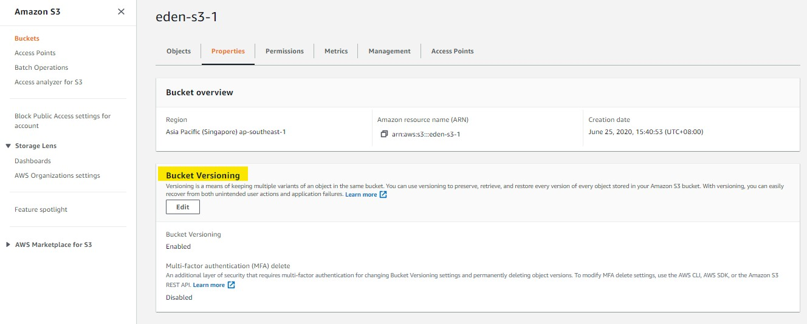
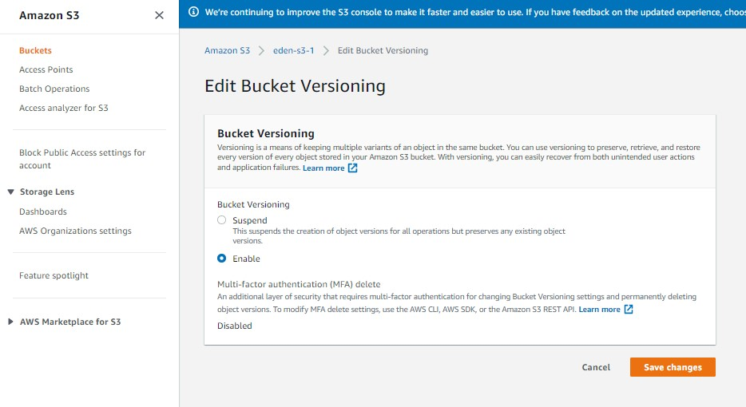
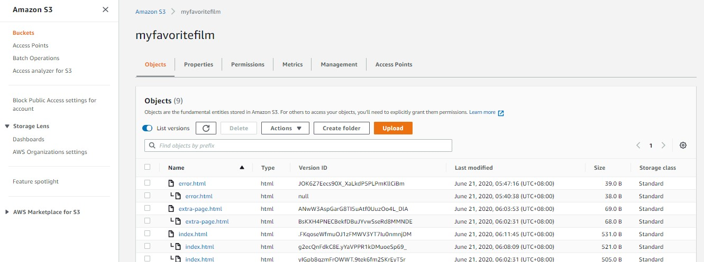

<!-- 2021-02-07 00:48:20 -->

#  08 - S3 for SysOps #
________________________________________

This note will dive in on S3 topics that are important to know for the SysOps exam. You can checkout the basics and theory of S3 in [07 - S3 Fundamentals](07-S3-Fundamentals.md).


This note is divided into these sections:

1.  [S3 Versioning Advanced](#s3-versioning-advanced)
2.  [S3 MFA Delete](#s3-mfa-delete)
3.  [S3 Default Encryption](#s3-default-encryption)
4.  [S3 Access Logs](#s3-access-logs)
5.  [S3 Replication](#s3-replication)
6.  [S3 Pre-signed URLs](#s3-pre-signed-urls)
7.  [CloudFront Overview](#cloudfront-overview)
8.  [CloudFront Monitoring](#cloudfront-monitoring)
9.  [S3 Inventory](#s3-inventory)
10. [S3 Storage Tiers](#s3-storage-tiers)
11. [S3 Lifecycle Policies](#s3-lifecycle-policies)
12. [S3 Performance](#s3-performance)
13. [S3 and Glacier Select](#s3-and-glacier-select)
14. [S3 Event Notifications](#s3-event-notifications)
15. [S3 Analytics](#s3-analytics)
16. [Glacier Overview](#glacier-overview)
17. [Glacier S3 Storage Class](#glacier-s3-storage-class)
18. [Glacier Vault Lock](#glacier-vault-lock)
19. [Snowball Overview](#snowball-overview)
20. [Storage Gateway for S3](#storage-gateway-for-s3)
21. [Athena Overview](#athena-overview)
_______________________________________________

## S3 Versioning Advanced ##

S3 Versioning creates a new version each time you change a file.
- you can enable verisoning during bucket creation
- you can also do it in the **Properties** tab

    
    
    

- you can list down the versions by enabling **List versions**

    

- encrypting the file also creates a new version
- deleting a file just adds a delete marker to the version
- to restore a deleted file, just delete the version with delete marker
- to delete a bucket, you must remove all file versions in it
_______________________________________________

## S3 MFA Delete ##

We ca use MFA Delete which forces the user to generate a code on a device, usually a mobile phone, and S3 must authenticate that code before allowing the user to proceed with the operations on S3.
- **you can use MFA for:**
    - permanently delete a version 
    - suspend versioning on the bucket
- **you won't need MFA for:**
    - enabling versioning
    - listing deleted versions

Important tips to remember
- MFA Delete can only be enabled/disabled by **bucket owner(root account)**
- you must **enable versioning first**
- you can then **enable MFA Delete thru CLI only**

    ```bash
    # you can enable/disable versioning and MFA Delete 
    # on the 4th line

    aws s3api put-bucket-versioning \
    --bucket <insert-bucket-name> \
    --versioning-configuration \
    Status=Enabled,MFADelete=Disabled \
    --mfa "<insert-ARN-of MFA-device> <insert-MFA-code>" \
    --profile <insert-root-username>
    ```
_______________________________________________

<!-- 2021-02-07 13:25:30 -->

## S3 Default Encryption ##

The traditional way to enable default encryption was to use **Bucket Policies** and refuse any HTTP command without the proper headers.

The new way is to use **Default encryption** under the **Properties** tab.
    


Note that **Bucket Policies are evaluated first before default encryption.**
_______________________________________________


## S3 Access Logs ##

<p align=right>
    
    
You may have an entire bucket dedicated for S3 logs for audit purposes.

- any request made to S3 will be logged into these bucket
- the request could be from any account, 
**authorized or denied**
- data can then be analyze using analysis tools
- **to enable access logging**, on your monitored bucket, 
    go to the **Properties > Server accesss logging** 

    


### S3 LOGS: WARNINGS ###

- Do not set your logging bucket as the monitoring bucket
- this will create a **logging loop**, growing the size exponentially


</p>
_______________________________________________

## S3 Replication ##

_______________________________________________

## S3 Pre-signed URLs ##

_______________________________________________

## CloudFront Overview ##

_______________________________________________

## CloudFront Monitoring ##

_______________________________________________

## S3 Inventory ##

_______________________________________________

## S3 Storage Tiers ##

_______________________________________________

## S3 Lifecycle Policies ##

_______________________________________________

## S3 Performance ##


_______________________________________________

## S3 and Glacier Select ##


_______________________________________________

## S3 Event Notifications ##


_______________________________________________

## S3 Analytics ##


_______________________________________________

## Glacier Overview ##


_______________________________________________

## Glacier S3 Storage Class ##


_______________________________________________

## Glacier Vault Lock ##


_______________________________________________

## Snowball Overview ##


_______________________________________________

## Storage Gateway for S3 ##


_______________________________________________

## Athena Overview ##

_______________________________________________
